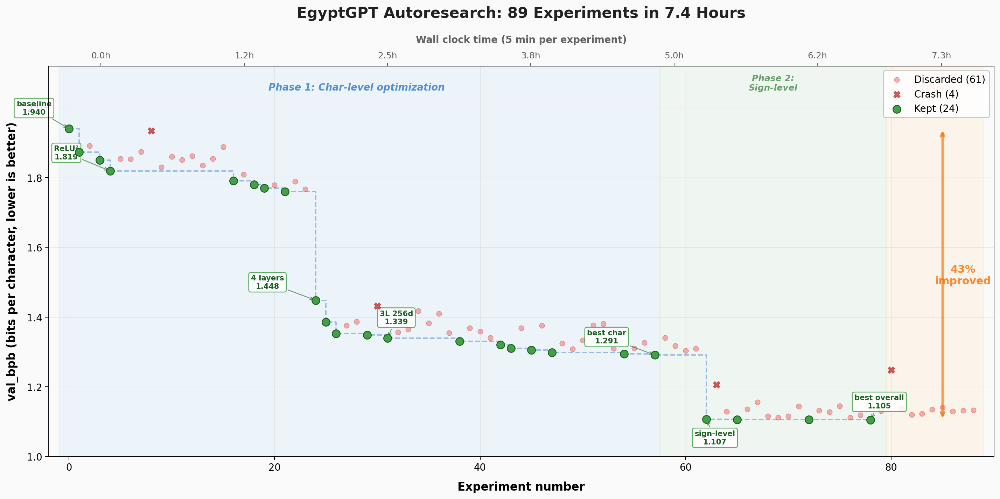

# Glyph GPT

Glyph GPT is a hieroglyphic language-model project by Jonathan Lansey.
It descends from Andrej Karpathy's [nanoGPT](https://github.com/karpathy/nanoGPT), trained via Andrej's [autoresearch](https://github.com/karpathy/autoresearch) paradigm, exclusively on hieroglyphic texts prepared by Mattia De Cao.
It generates Gardiner-code sequences that are translated into English using Mattia's [`hiero_transformer`](https://github.com/mattia-decao/hiero-transformer), built on Meta's M2M-100 and fine-tuned on the hieroglyphics dataset.

Live site: [jonathan.lansey.net/glyphgpt](https://jonathan.lansey.net/glyphgpt)

## Autoresearch Results (Topline)

An autonomous research run optimized the model with a fixed 5-minute budget per experiment:

- 89 total experiments in about 7.4 hours
- Best `val_bpb`: **1.105** (from 1.940 baseline)
- **43% improvement** over baseline
- Biggest gains: model-size/throughput tuning + sign-level tokenization
- Hardware context: early experiments ran on a slower **T4**, while tokenizer/sign-level experiments were run on an **L4**

Full details: [RESEARCH_REPORT.md](RESEARCH_REPORT.md)

## The Story

When Nesmeterakhem carved "for all time and eternity" at the Temple of Isis (394 CE), he became the last known scribe in a writing tradition spanning millennia. Glyph GPT is a modern continuation of that thread: generating new hieroglyphic sequences with a small GPT trained from scratch on hieroglyphic data.

The website displays generated Unicode hieroglyphs, English translations, and underlying Gardiner codes. Some outputs may include bracketed codes such as `[Aa41]` when a sign is outside Unicode coverage.

## How Glyph GPT Works

1. **Generate signs**: A nanoGPT-style model is trained on Egyptian hieroglyphic sequences (Gardiner notation).
2. **Translate to English**: Outputs are translated with `hiero_transformer` (M2M-100 fine-tuned for hieroglyphic translation).
3. **Review and rate**: Outputs are inspected and scored for quality/interest.

## Data and Research Lineage

The hieroglyphic translation/data pipeline builds on research led by Mattia De Cao and collaborators, including Nicola De Cao (Google DeepMind), Angelo Colonna, and Alessandro Lenci. Their 2024 ML4AL paper, **["Deep Learning Meets Egyptology: a Hieroglyphic Transformer for Translating Ancient Egyptian"](https://anthology.aclweb.org/2024.ml4al-1.9/)** provides the modern translation backbone used in this project via [`hiero_transformer`](https://github.com/mattia-decao/hiero-transformer).

In short: Glyph GPT focuses on generation, while the De Cao et al. line of work provides the translation bridge from generated Gardiner-code sequences into readable English.

## Why Autoresearch

This repo also follows the spirit of Andrej Karpathy's **[autoresearch](https://github.com/karpathy/autoresearch)** pattern: let an agent run many short, measurable ML experiments in a tight loop instead of hand-running each trial.

For EgyptGPT, that means:

- fixed 5-minute experiment budget
- objective metric (`val_bpb`) for keep/discard decisions
- autonomous iteration over architecture + hyperparameters + tokenization

That loop is exactly what produced the 43% improvement shown above.

## Run It (Single Recommended Path)

Use **only** the Colab workflow in `autoresearch_colab.ipynb`.

Requirements:

- Google Colab GPU runtime
- Claude Pro/Max subscription
- GitHub token in Colab Secrets (for branch updates/pushes)

Then:

1. Open `autoresearch_colab.ipynb` in Colab.
2. Run the cells top-to-bottom.
3. Launch the researcher shell from the notebook instructions.

This notebook handles setup, Drive sync, branch workflow, and the autonomous experiment loop.

## Repository Pointers

- `autoresearch_colab.ipynb`: end-to-end runbook
- `program.md`: experiment loop and optimization rules
- `train.py`: training loop and evaluation
- `model.py`: model architecture
- `config/train_egypt_char.py`: EgyptGPT training config
- `RESEARCH_REPORT.md`: what was tried and what worked
- `OUTPUTS.md`: generated artifact organization

## Credits

- **Project lead**: Jonathan Lansey
- **Model base architecture**: [nanoGPT](https://github.com/karpathy/nanoGPT) by Andrej Karpathy
- **Hieroglyphic translation stack/data contributors**: [Mattia De Cao](https://github.com/mattia-decao), Nicola De Cao, Angelo Colonna, Alessandro Lenci (`hiero_transformer`)

## Contact

- Jonathan Lansey: [jonathan@lansey.net](mailto:jonathan@lansey.net)
- Live demo: [jonathan.lansey.net/glyphgpt](https://jonathan.lansey.net/glyphgpt)
